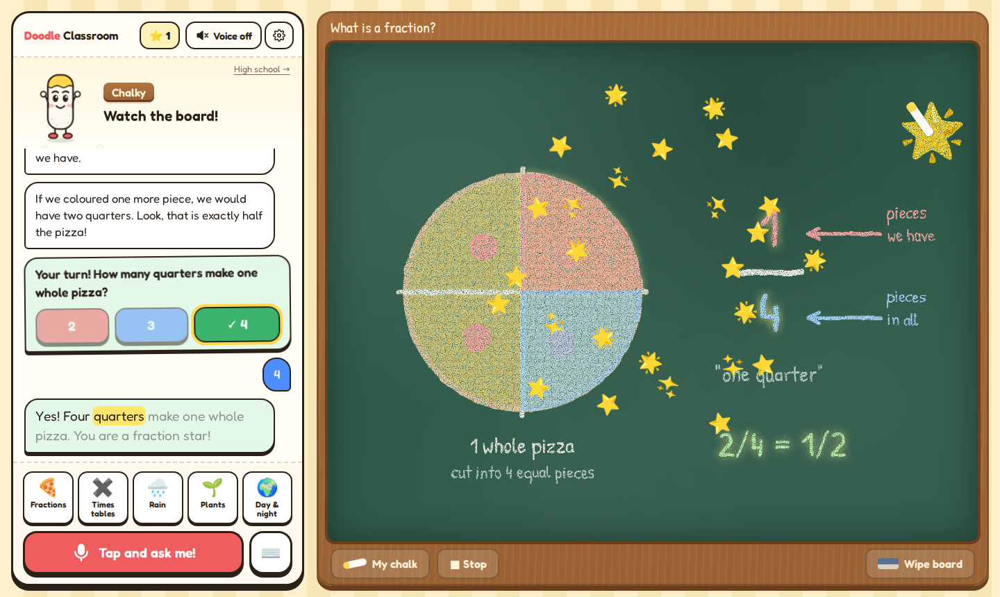
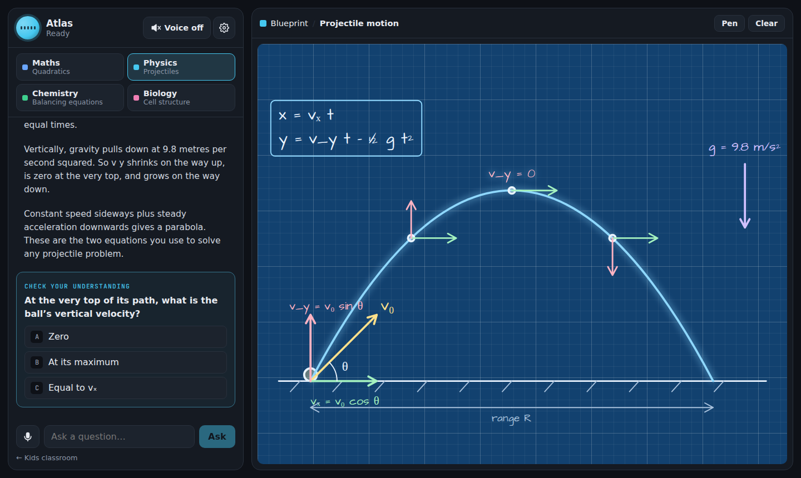
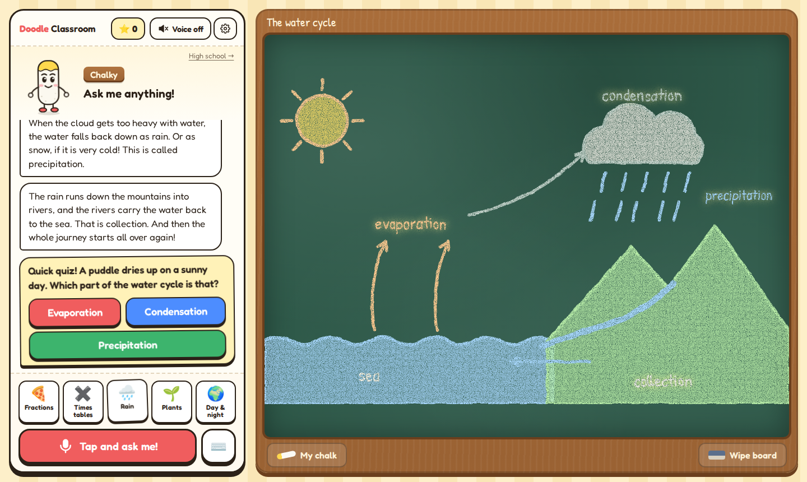
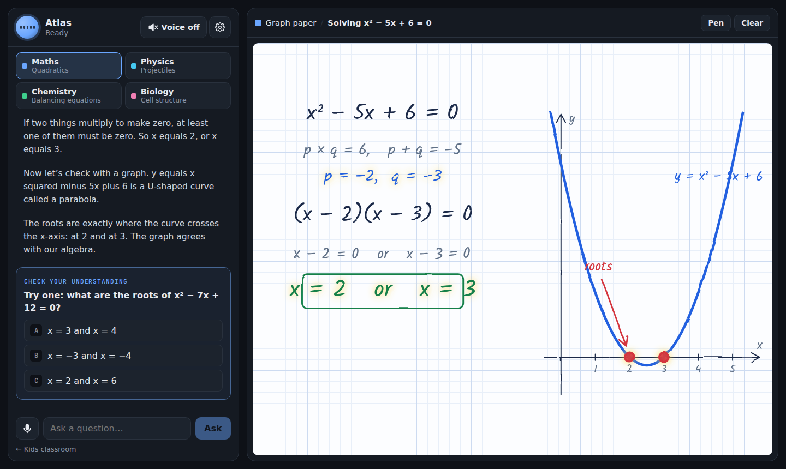
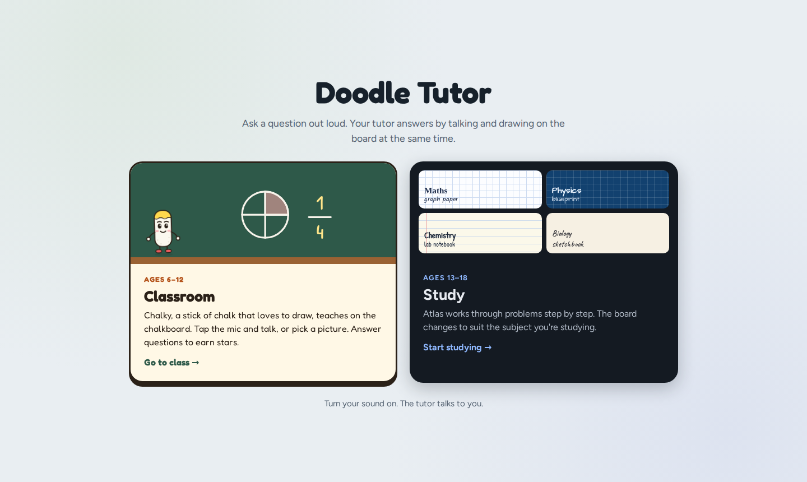
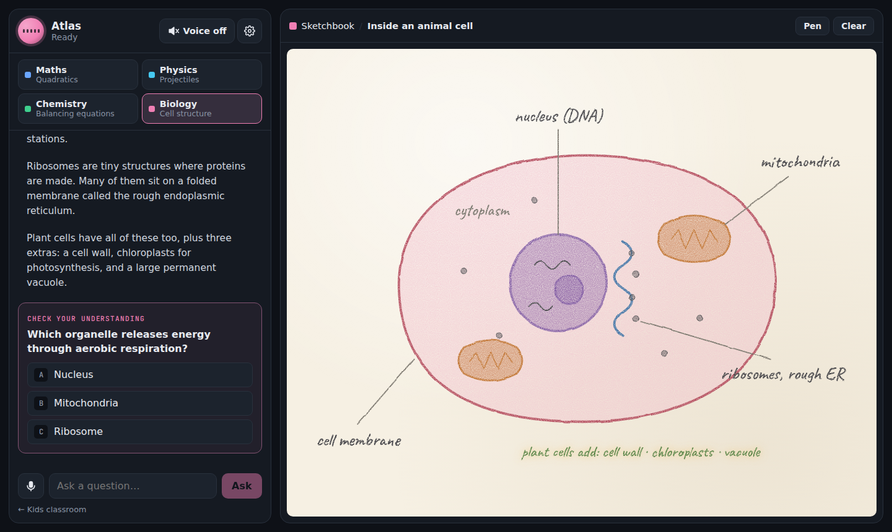

# Doodle Tutor

An AI tutor concept where the tutor **talks and draws at the same time**. The conversation sits on the left (30%) and the board on the right (70%). It comes in two versions:

- **Classroom (ages 6–12):** Chalky, a living stick of chalk, teaches on a chalkboard. Children tap a big mic button or a picture card to ask, follow the words as they're read aloud, and earn stars for answering check-in questions.
- **Study (ages 13–18):** Atlas works through problems step by step. The board changes with the subject: graph paper for Maths, blueprint for Physics, a lab notebook for Chemistry, and a sketchbook for Biology.

📄 **Concept document:** [`docs/CONCEPT.md`](docs/CONCEPT.md)

| Classroom | Study |
|---|---|
|  |  |
|  |  |
|  |  |

## Run it

```bash
npm install
npm run dev
```

Open the printed URL in Chrome, Edge or Safari with your sound on, then pick **Classroom** or **Study**.

- **Kids:** tap 🍕 Fractions, ✖️ Times tables, 🌧️ Rain, 🌱 Plants or 🌍 Day & night, or tap **Tap and ask me!** and say a question. Any multiplication up to 10 × 10 ("what is 7 times 6?") is generated on the fly.
- **High school:** pick a subject card, or ask about quadratics, projectile motion, balancing equations or cells.
- **Voice:** uses the browser's built-in voices, so no API key is needed. Use ⚙ to pick a voice and speed. Voice input needs microphone permission; where it's blocked, the app says so and you can type instead.

## Build

```bash
npm run build           # regular static site in dist/
npm run build:artifact  # single page (React from cdnjs) in dist-artifact/doodle-tutor.html
```

## How it works

Every answer is a **lesson**: a list of steps, each with a sentence to say and drawing commands to run while saying it. The player speaks and draws in parallel and moves on when both are done. The prototype's "brain" is keyword matching (`src/tutor/brain.ts`); in production an LLM returns the same JSON through a `teach_on_whiteboard` tool. Colours in lessons are theme tokens, so one lesson renders correctly on any board.

```
src/
  App.tsx       landing: pick Classroom or Study
  kids/         classroom screen and Chalky
  teens/        study screen
  shared/       session state (chat, check-ins, stars), mic, voice settings, read-along
  tutor/        lessons, brains, lesson player
  whiteboard/   drawing language, board themes, animated SVG renderer
  voice/        browser text-to-speech and speech recognition
```
