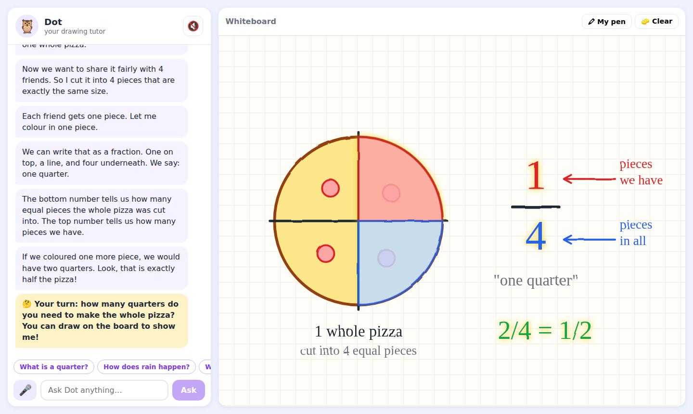
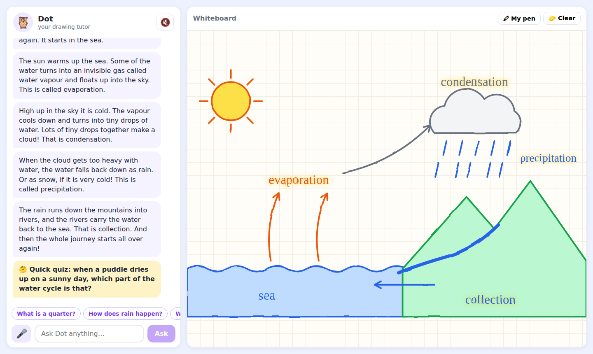

# Doodle Tutor

An AI tutor concept for children aged 6–12. A chat and voice tutor sits on the left (30%), and a whiteboard on the right (70%) where the tutor **draws its explanation while speaking it**.

- 📄 **Concept document:** [`docs/CONCEPT.md`](docs/CONCEPT.md)
- 🧪 **Clickable prototype:** this repo (React + TypeScript + Vite)




## Run the prototype

```bash
npm install
npm run dev
```

Open the printed URL in Chrome or Edge (needed for voice input), press **Start**, then try:

- "What is a quarter?"
- "How does rain happen?"
- "What is 7 × 6?" (any multiplication up to 10 × 10 is generated on the fly)
- "How do plants eat?"
- "Why is there night?"

Tap 🎤 to ask by voice, 🔊 to mute Dot, and **🖍 My pen** to draw on the board yourself. Asking a new question interrupts the current explanation.

## How it works

The tutor's answer is a **lesson**: a list of steps, each with a sentence to say and drawing commands to run while saying it. The prototype uses a keyword-matching stand-in (`src/tutor/brain.ts`). In production, an LLM produces the same JSON through a `teach_on_whiteboard` tool. See the concept doc for the full design.

```
src/
  whiteboard/   drawing language (types.ts), geometry, animated SVG renderer
  tutor/        demo lessons, brain interface, lesson player (voice and drawing in sync)
  voice/        browser text-to-speech and speech recognition
  components/   chat panel
```
